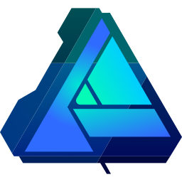

<!-- 
	- Icons: https://devicon.dev/ 
	- A lot of stuff: https://github.com/VeroMoreno/readme-deadlines/blob/master/README-personal.md
	- Good looking stats: https://github.com/anuraghazra/github-readme-stats
	- Shields for states and media: https://shields.io/
									https://dev.to/envoy_/150-badges-for-github-pnk
-->

# Hello world! I'm Lalo
I'm a developer interested on task automation, bots and every kind of new and exciting technology in general! 

If it doesn't exists, code it!

|        Github stats         |         Most used languages          |
| :-------------------------: | :----------------------------------: |
| ![statsOscuro][statsOscuro] | ![lenguajesOscuro][lenguajesOscuro]  |

[statsOscuro]: https://github-readme-stats.vercel.app/api?username=la-lo-go&show_icons=true&hide_title=true&hide=issues&theme=blueberry&hide_border=true&border_radius=2%#gh-dark-mode-only

[statsClaros]: https://github-readme-stats.vercel.app/api?username=la-lo-go&show_icons=true&hide_title=true&theme=buefy&hide_border=true&border_radius=2%#gh-light-mode-only

[lenguajesOscuro]: https://github-readme-stats.vercel.app/api/top-langs/?username=la-lo-go&layout=compact&hide_title=true&theme=blueberry&hide_border=true&border_radius=2%&langs_count=6#gh-dark-mode-only

[lenguajesClaro]: https://github-readme-stats.vercel.app/api/top-langs/?username=la-lo-go&layout=compact&hide_title=true&theme=buefy&hide_border=true&border_radius=2%&langs_count=6#gh-light-mode-only

# Tech Stack
## Languages

## Web Development
<!-- Structure and logic -->

<!-- Styles -->

<!--

## Databases

 

-->

## Tools & Technologies

<!-- 

## Cocreator
 

-->

# Graphic Desing Stack

 

# Socialmedia

# Listening to...

